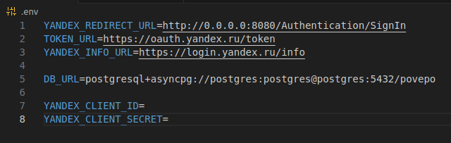

# Тестовое задание от Pavepo

<br>

Содержание:
- <a href='#тз'>Техническое задание</a>
- <a href='#запуск'>Запуск решения</a>
- <a href='#гайд'>Гайд по использованию функций</a>

<br><br>

<h1 id='тз'>Техническое задание</h1>

Реализовать сервис по загрузке аудио-файлов от пользователей, используя FastAPI, SQLAlchemy и Docker.<br> 
Пользователи могут давать файлам имя в самом API.<br>
Авторизацию пользователей реализовать через Яндекс.<br>
Файлы хранить локально, хранилище использовать не нужно.<br>
Использовать асинхронный код.<br>
БД - PostgreSQL. <br><br>


Ожидаемый результат:
1. Готовое API с возможностью авторизации через Яндекс с последующей аутентификацией к запросам через внутренние токены API.
Доступные эндпоинты: 
- авторизация через яндекс
- обновление внутреннего access_token 
- получение / изменение данных пользователя
- удаление пользователя от имени суперпользователя 
- получение информации о аудио файлах пользователя: название файлов и путь в локальной хранилище

2. Документация по развертыванию сервиса и БД в Docker.


<br> <br> 

<h1 id='запуск'>Запуск решения</h1>
Скопируйте проект себе на устройство

```sh
https://github.com/irsCooper/audio_povepo.git
```

Для комфорта выполнения следующих действий, откройте корневую папку проекта в удобном вам IDE <br>

Перейдите в файл __.env__, вы должны видеть что-то такое:


Нам нужно заполнить поля __YANDEX_CLIENT_ID__ и __YANDEX_CLIENT_SECRET__. Для этого открываем сайт [Яндекс ID](https://id.yandex.ru/)

После авторизации, в панели слева, нам нужно выбрать __Ещё__, пролистать вниз до раздела __Бизнес__ и выбрать __Яндекс ID для сайта__.<br>

Отлично! Теперь нажимаем на __Создать приложение__ и заполняем нужные данные:
- __Название__ (выбирайте самостоятельно)
- __Иконка__ (при необходимости, выбирайте самостоятельно)
- __Для каких платформ нужно приложение__ выбираем __Веб-серисы__
- __Доступ к данным__ оставляем это (дата рождения, адрес электронной почты, логин имя фамилия пол)
- __Redirect URI__ пишем следующее __http://0.0.0.0:8080/Authentication/SignIn__ 
- __Suggest Hostname__ пишем следующее __http://0.0.0.0:8080__ 
- __Почта__ указывайте любую

<br>

Поздравляю! Мы создали наше "приложение". Теперь, нужно сделать то, для чего мы изначально это делали :) <br>

Дополним наш __.env__ файл! <br>

Заполняем в соответствии с этим:
- __YANDEX_CLIENT_ID__ == __ClientID__ из нашего "приложения" в Яндекс ID
- __YANDEX_CLIENT_SECRET__ == __Client secret__ из нашего "приложения" в Яндекс ID

<br><br>

# Запуск
Наконец-то! Для этого проверьте, что на вашем устройстве установлен Docker и он корректно настроен. <br>

### Открываем корневую директорию проекта в терминале и выполняем следующую команду:

```sh 
docker compose up -d
```

Если вы используете версию docker compose, в которой нужно, чтобы была указана версия (при запуске у вас что-то пошло не так), __откройте файл docker-compose.yaml в корневой директории проекта__ и раскомментируйте первую строчку. <br><br>

Чудесно, у нас создалось 2 контейнера
1. база данных
2. наш сервис

<br>

Теперь, давайте расскажу, как им правильно пользоваться


<h1 id='гайд'>Гайд по использованию функций</h1>

1. __Авторизация через яндекс__. Так как по канону, это делается с интерфейса при нажатии на кнопку, а нашей целью было разработать бэкенд - __будем выкручиваться__. Чтобы выполнить вход, нам нужно вызвать метод __/Authentication/PreSignIn__. Он вернёт нам ссылку -> нужно перейти по этой ссылке (открыть её в браузере). Перед вами появится окошко, которое предложит вам войти в аккаунт Яндекс. Подтверждаете это действие и вас редеректит на http://0.0.0.0:8080/Authentication/SignIn, тем самым вызывая метод в нашем сервисе. В ответ вы должны получить __access_token__ и __refresh_token__. Пока что не закрывайте страницу, она нам ещё понадобиться 

2. Я думаю, что у вас достаточно опыта работы с подобными api документациями, по этому не буду подробно объяснять на какие кнопки нажимать. __Но уточню, что для авторизации вам понадобится access_token__

3. В остальном, я надеюсь по названиям и описаниям функций будет понятно как с ними взаимодействовать 

__Спасибо за уделённое время! |__ 
__&copy;Понакшина Ирина Александровна__ 